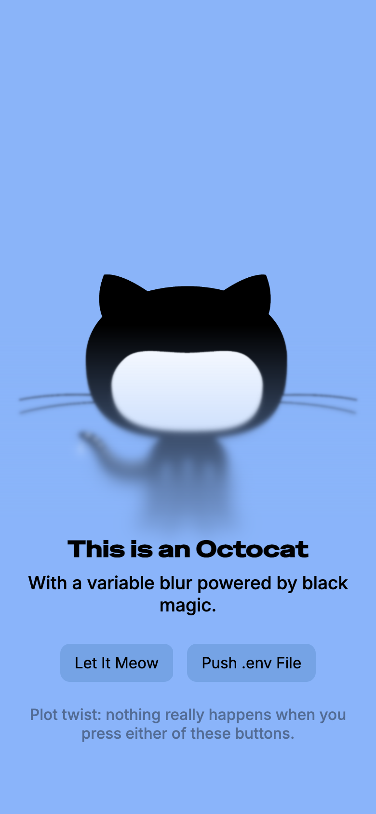

# VariablurJS



Variable blur and filter utility for web overlays, inspired by iOS and original [Variablur](https://github.com/daprice/Variablur) project. Supports variable blur and other CSS filters.

[View Demo 1](https://html-preview.github.io/?url=https://github.com/berkaytumal/VariablurJS/blob/main/examples/demo.html)

[View Demo 2](https://html-preview.github.io/?url=https://github.com/berkaytumal/VariablurJS/blob/main/examples/demo2.html)


[View Refraction Demo](https://html-preview.github.io/?url=https://github.com/berkaytumal/VariablurJS/blob/main/examples/refraction.html)


## Usage

Just include the script directly in your HTML:

```html
<script src="/path/to/variableblur/index.js"></script>
```

After loading, `VariablurJS` is available globally. It works automatically on elements using the correct CSS variables—no need to call any methods manually.

See `examples/demo.html` for a usage example in the browser.

## API (Advanced)

If you want to control it manually, you can use:

- `VariablurJS.attach(element)` – Attach variable blur to an element (and its descendants)
- `VariablurJS.detach(element)` – Remove variable blur from an element
- `VariablurJS.update(element)` – Manually update blur on an element
- `VariablurJS.hasAnyVariablurCSS(element)` – Check if element uses variable blur CSS variables
- Math utilities: `calcBlurPerLayer`, `exponentialBlurLayers`, etc.
- `VariablurJS.startPolling()` – Start global automatic polling for all attached elements (default: enabled at startup)
- `VariablurJS.stopPolling()` – Stop global automatic polling
- `VariablurJS.calculateRefractionMap(refraction, offset, width, height)` – Generate displacement maps for glass effects
- `VariablurJS.createGlassSVGFilter(element)` – Create SVG filters for glass refraction effects

> **Note:**  
> If you want to use `attach`, `detach`, or `update` manually, **call `VariablurJS.stopPolling()` first** to prevent the automatic polling from interfering with your manual control.

## CSS Variables

- `--variablur-filter`: CSS filter string (e.g. `blur(20px)`)
- `--variablur-direction`: `top`, `bottom`, `left`, `right`
- `--variablur-offset`: e.g. `40px`, `20%`, or `calc(50% - 10px)`  
  Controls how far from the specified edge the blur/fade effect extends into the element.
- `--variablur-layers`: number of layers (default: 5)
- `--variablur-color`: overlay color (default: transparent)
- `--variablur-glass-refraction`: glass refraction intensity (e.g. `1.5` for moderate refraction, `2.0` for strong)
- `--variablur-glass-offset`: glass effect displacement area size in pixels (e.g. `20px`)

## Glass Refraction Effects

VariablurJS now supports realistic glass refraction effects using SVG displacement mapping, inspired by iOS 18's Liquid Glass effects. This creates authentic distortion effects that simulate light bending through glass surfaces.

### How to Use Glass Effects

Add the glass refraction CSS variables to any element:

```css
.glass-panel {
  --variablur-glass-refraction: 2;
  --variablur-glass-offset: 30px;
  /* Optional: combine with blur for frosted glass effect */
  --variablur-filter: blur(5px);
}
```

### Glass Effect Parameters

- **`--variablur-glass-refraction`**: Controls the intensity of light bending
  - `1.0` = no refraction (neutral)
  - `1.33` = water-like refraction
  - `1.5` = glass-like refraction
  - `2.0` = strong crystal-like refraction

- **`--variablur-glass-offset`**: Defines the size of the displacement area in pixels
  - Larger values create wider refraction zones
  - Typically ranges from `10px` to `50px`

See `examples/refraction.html` for interactive examples and visual demonstrations.

### Notes

- The prefix for all CSS variables is `--variablur-`.
- `--variablur-offset` is interpreted as the distance from the chosen edge where the blur/fade effect extends into the element.  
  (e.g. `40px` means the effect transitions over 40px from the edge.)
- The library automatically observes DOM and CSS variable changes using a polling mechanism by default.
- No need to call any methods for basic usage—just set the CSS variables on your element.
- When you call `attach(element)`, all descendants with variablur CSS variables are also attached automatically.
- **If you want to manage elements manually, call `VariablurJS.stopPolling()` first.**

## Contributing

Contributions are most welcome! Feel free to submit issues and pull requests to help improve **VariablurJS**.

1. Fork the repository.
2. Create a new branch for your feature or bugfix.
3. Submit a pull request when your code is ready.

## License

This project is licensed under the MIT License - see the [LICENSE](LICENSE) file for details.

## Contact

For any inquiries or feedback, feel free to reach out!

<a href="https://www.buymeacoffee.com/berkaytumal" target="_blank"></a>